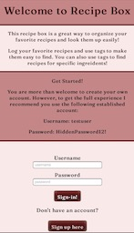
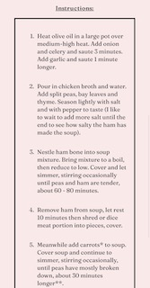

Recipe Box

This app allows users to add their recipes and give them a tag so they are easier to find!

You can find the live app here https://recipe-box-12.vercel.app/

You are more then welcome to create your own account. However, I recommend using the demo account to get the full experience

-------------------------
Demo User Details:

username: newuser
 
password: newPassword2!
-------------------------

Screenshots:

 

 

 

Technology:

Front End

    -React
    -HTML
    -CSS(No frameworks)

Testing

    -Jest

Production

    -Deployed using Vercel

-------------------------

Getting Started

Run npm install to load dependencies

Run npm test to ensure a stable build

This is only the front end client, to develop locally you'll need the backend server as well.

To get the backend up and running see https://github.com/LeahArden175/recipe-box-server

Deployments are handled through vercel and can be run via npm run deploy